# AEM Fragment Variations in MAS Studio

## Overview

MAS Studio implements **locale-based variations** for Content Fragments. A variation is a localized copy of a fragment that can override specific fields while inheriting others from a "parent" (master) fragment.

---

## 1. Variation Creation Flow


---

## 2. Data Structure

```mermaid
erDiagram
    PARENT_FRAGMENT ||--o{ VARIATION_FRAGMENT : "has variations"

    PARENT_FRAGMENT {
        string id PK "abc123"
        string path "/content/dam/mas/cards/en_US/card"
        string title "Creative Cloud"
        string price "$54.99/mo"
        string cta "Buy now"
        array variations "['def456', 'ghi789']"
    }

    VARIATION_FRAGMENT {
        string id PK "def456"
        string path "/content/dam/mas/cards/en_GB/card"
        string originalId FK "abc123"
        string price "£44.99/mo"
    }
```



---

## 3. Field Resolution Logic


---

## 4. Field State Machine


---

## 5. Editor Loading Flow

```mermaid
flowchart TD
    A[Editor Opens Fragment] --> B[Load fragment from AEM]
    B --> C{Has originalId?}

    C -->|Yes| D[This is a VARIATION]
    C -->|No| E[This is a PARENT]

    D --> F[Fetch parent fragment]
    F --> G[Merge parent fields<br/>for preview]
    G --> H[Show inherited/overridden<br/>indicators in UI]

    E --> I[Load variations list]
    I --> J[Show "Add Variation" button]

    H --> K[Editor Ready]
    J --> K

    style D fill:#87CEEB
    style E fill:#90EE90
```

---

## 6. Complete System Overview


---

## 7. Reset Field Operation


---

## Key Design Decisions

### 1. Why `originalId` field instead of AEM's native variation model?
- AEM Content Fragment variations are designed for same-fragment variations (e.g., "web" vs "mobile" renditions)
- Locale variations need separate fragments in different folders for proper localization workflows
- Custom `originalId` field provides flexibility without AEM constraints

### 2. Why sparse storage?
- Reduces storage footprint
- Makes inheritance explicit (missing = inherited)
- Simplifies "reset to parent" operation (just delete field)

### 3. Why copy all fields initially, then delete?
- Ensures variation is functional standalone if parent is unavailable
- Allows gradual cleanup of redundant fields
- Simpler copy operation at creation time

---

## Key Files

| Purpose | File |
|---------|------|
| Variation creation dialog | `studio/src/mas-variation-dialog.js` |
| Fragment model (isVariation, getEffectiveFieldValue) | `studio/src/aem/fragment.js:88-195` |
| AEM copy operation | `studio/src/aem/aem.js:631-661` |
| Parent fragment loading | `studio/src/mas-fragment-editor.js:527-587` |
| Editor context/state | `studio/src/reactivity/editor-context-store.js` |
