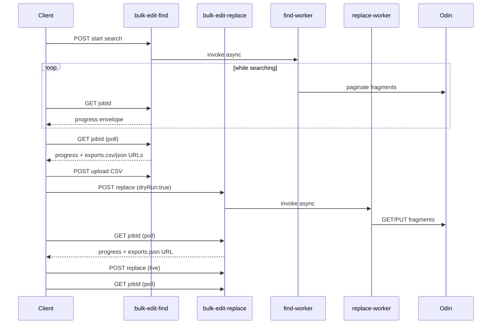

# Bulk Find & Replace

Search MAS fragments across a surface, export matches, edit replacements in CSV, and apply changes to Odin — all as async jobs on Adobe I/O Runtime.

Base path: `{host}/api/v1/web/MerchAtScaleStudio/`

**Web actions**

| URL path | Role |
|----------|------|
| `bulk-edit-find` | Start find jobs, poll progress, upload edited CSV, download find exports |
| `bulk-edit-replace` | Start replace jobs (dry run or live), poll progress, download replace exports |

Both web actions share one Runtime function (`bulk-edit.js`). Find vs replace is selected via the action's `bulkEditMode` input (`find` or `replace`).

Example requests live in [`io/studio/requests.http`](../../requests.http).

---

## End-to-end workflow

```
Find (bulk-edit-find)
  1. POST  /bulk-edit-find              → start search (202 + jobId)
  2. GET   /bulk-edit-find?jobId={id}    → poll until done=true, exportReady=true (response includes exports.json + exports.csv)
  3. Edit CSV locally                     → optional: select a subset of rows to replace
  4. POST  /bulk-edit-find?jobId={id}    → optional: upload CSV to limit replace scope
  4b.DELETE /bulk-edit-find?jobId={id}   → optional: remove upload, restore full exports

Replace (bulk-edit-replace)
  5. POST  /bulk-edit-replace             → { findJobId, replace, dryRun? } — dry run first, then live
  6. GET   /bulk-edit-replace?jobId={id}  → poll until done=true, exportReady=true (response includes exports.json)
```



Use the find endpoints for find jobs and the replace endpoints for replace jobs. Using the wrong endpoint for a `jobId` returns `400`.

---

## HTTP API

All requests require a valid `Authorization: Bearer <IMS token>`.

### Find — `POST /bulk-edit-find`

Start a search.

```json
{
  "surface": "sandbox",
  "find": "firefly",
  "searchIn": "*",
  "matchCase": false,
  "locale": ["en_US"],
  "tags": ["mas:plan_type/abc"],
  "status": "PUBLISHED",
  "forceRefresh": false
}
```

| Field | Required | Notes |
|-------|----------|-------|
| `surface` | yes | e.g. `sandbox`, `acom` |
| `find` | yes | Text to search for |
| `searchIn` | no | Field scope or `"*"` for all scopes in `SCOPE_FIELDS` (`prices`, `ctas`, `calloutText`, `productDescription`, `promoText`, `subtitle`, `fragmentDescription`, `fragmentTitle`, `tags`) — not arbitrary Odin fields |
| `matchCase` | no | Default `false` |
| `locale` | no | String or array; omit for all locales |
| `tags` | no | Filter by fragment tags |
| `status` | no | e.g. `PUBLISHED`, `DRAFT` |
| `forceRefresh` | no | Re-run even if a cached job exists |

Response: `202 { jobId, reused }`

### Find — poll / upload

| Method | URL | Purpose |
|--------|-----|---------|
| `GET` | `/bulk-edit-find?jobId={id}` | Progress envelope; when `exportReady`, includes `exports.json` and `exports.csv` presigned URLs |
| `POST` | `/bulk-edit-find?jobId={findJobId}` | Upload edited CSV (filters exports) |
| `DELETE` | `/bulk-edit-find?jobId={findJobId}` | Remove uploaded CSV (restore full exports) |

Progress response (result rows are not included — download via `exports` URLs when ready):

```json
{
  "jobId": "abc…",
  "type": "find",
  "status": "DONE",
  "done": true,
  "total": 42,
  "report": { "total": 42, "byLocale": { "en_US": 30, "fr_FR": 12 } },
  "filteredByUpload": false,
  "exportReady": true,
  "exports": {
    "json": "https://…presigned…",
    "csv": "https://…presigned…"
  }
}
```

Export URLs are presigned Adobe I/O Files links (valid 24 hours). Follow them without the IMS `Authorization` header. If the Files copy is missing or expired, the poll GET regenerates exports from cached state results (7-day window) before returning fresh URLs.

Allowed when `status` is `DONE` or `CANCELLED`.

After a find completes, the full result set is retained internally. **Download JSON/CSV** (`results.json` / `results.csv`) reflects the current view:

- **No upload** — all matches from the search
- **After CSV upload** — only rows present in the uploaded CSV (with `replace` values merged into the CSV export); upload response includes filtered `total` and `report`
- **After CSV delete** — restored to the full unfiltered result set

CSV upload: `Content-Type: text/csv` or `multipart/form-data` with a file part. Find job must be complete. Each row must match a `(fragment_id, field, find)` triple from the **full** find results (not only the currently filtered export). Rows in the upload define the filter — omitted find rows are excluded from exports until the upload is removed.

Upload response:

```json
{
  "jobId": "abc…",
  "rowsAccepted": 3,
  "filteredByUpload": true,
  "total": 3,
  "report": { "total": 3, "byLocale": { "en_US": 3 } },
  "exportReady": true
}
```

Remove upload — `DELETE /bulk-edit-find?jobId={findJobId}`:

```json
{
  "jobId": "abc…",
  "filteredByUpload": false,
  "total": 42,
  "report": { "total": 42, "byLocale": { "en_US": 30, "fr_FR": 12 } },
  "exportReady": true
}
```

### Replace — `POST /bulk-edit-replace`

Apply replacements for a completed find job. When no CSV is uploaded on the find job, **all find matches** are processed. An optional uploaded CSV limits replace to those rows only.

**Dry run** (preview, no Odin writes):

```json
{
  "findJobId": "abc…",
  "replace": "Firefly Pro",
  "dryRun": true
}
```

**Live run:**

```json
{
  "findJobId": "abc…",
  "replace": "Firefly Pro"
}
```

| Field | Required | Notes |
|-------|----------|-------|
| `findJobId` | yes | Completed find job (`DONE`) |
| `replace` | yes | Replacement text substituted for the find search term within each match |
| `dryRun` | no | `true` / `"true"` — preview only |

Response: `202 { jobId, reused, dryRun }`

### Replace — poll

| Method | URL | Purpose |
|--------|-----|---------|
| `GET` | `/bulk-edit-replace?jobId={replaceJobId}` | Progress envelope; when `exportReady`, includes `exports.json` presigned URL |

Suffix `.json` / `.csv` on `jobId` is not supported (`400`). Replace jobs export JSON only.

Progress response:

```json
{
  "jobId": "replace.abc….live.def…",
  "type": "replace",
  "status": "DONE",
  "done": true,
  "dryRun": false,
  "total": 10,
  "processed": 10,
  "succeeded": 8,
  "skipped": 2,
  "failed": 0,
  "conflicts": 0,
  "exportReady": true,
  "exports": {
    "json": "https://…presigned…"
  },
  "report": { "totalFragments": 10, "succeeded": 8 }
}
```

Poll until `done: true` and `exportReady: true`. Export URLs appear when `status` is `DONE`.

---

## CSV format

Fixed header (order matters):

```
fragment_id,path,locale,field,find,replace,etag,status
```

- One row per **match** (a fragment with two field hits → two rows)
- `field` is the Odin field name (e.g. `cardTitle`, `value`, `subtitle`); legacy scope labels (e.g. `productDescription`) are still accepted on CSV upload
- Leave `replace` empty on export; the replace text is supplied in `POST /bulk-edit-replace`
- **Tags** can appear in find results but are never rewritten on replace (rows come back `SKIPPED`)
- `{{placeholder}}` references in card content may be updated when the search term matches inside them

Row identity for validation: `fragment_id|field|find`.

---

## Job IDs and caching

**Find jobs** — derived from the normalized search parameters. Identical searches reuse the same `jobId` and return `{ reused: true }` while the job is still active or cached.

**Replace jobs** — a separate id tied to the find job, find run (`runId`), dry/live mode, uploaded CSV selection, and `replace` value. Refreshing a find job (new `runId`) produces a new replace id even when search params and replace text are unchanged. Changing the CSV, replace text, or toggling dry/live also produces a new id. Once a replace job is `RUNNING` or `DONE`, an identical POST returns `{ reused: true }` and does not restart the worker.

**Force refresh** — `forceRefresh: true` on find clears prior uploads and exports, then re-runs the search.

**Retention** — completed find/replace jobs, search results, uploaded CSV, and reports are kept in state for **7 days**. Each poll or download GET on a terminal job refreshes that window. RUNNING jobs use a 30-minute TTL refreshed by worker progress.

**Export regeneration** — export files in Adobe I/O Files may expire independently of state. A poll GET regenerates missing exports from cached state results, then returns fresh presigned URLs in `exports`.

---

## Replace behavior

1. Uploaded CSV rows are grouped by fragment; multiple field replacements on one fragment are applied in a single Odin PUT.
2. Replace substitutes the **find search term** (from the find job), not the full matched value in each CSV row. Rows where `replace` equals the search term, unchanged text, or tag fields are **skipped**.
3. **Dry run** — fetches each fragment from Odin, applies replacements in memory (no PUT), and exports JSON with full modified fragment payloads (`WOULD_REPLACE` items include `title`, `description`, `fields`). A `results-full.json` companion lists only modified fragments.
4. **Live run** — statuses are `REPLACED`, `SKIPPED`, `FAILED`, or `CONFLICT` (fragment changed since find).
5. Large replace jobs may run across multiple worker activations until complete.
6. **Immutability** — a started dry or live replace job cannot be stopped or restarted for the same find run. Re-POST with the same `findJobId`, find `runId`, `dryRun`, uploaded CSV, and `replace` returns `{ reused: true }` while the job is `RUNNING` or `DONE`. Refresh the find job (`forceRefresh`) first to start a new replace.

`matchCase` for replace is inherited from the original find job.

---

## Known limitations

Product and UX edge cases to plan for in clients (e.g. MAS Studio). Not an exhaustive API contract.

| Situation | Expected client behavior |
|-----------|-------------------------|
| Presigned URL expired | Poll again for fresh `exports` URLs (job must be within the 7-day cache window). |
| Export file missing or expired | Poll GET regenerates exports from cached state results, then returns new presigned URLs. |
| Job no longer found (`404`) | Cache expired after 7 days — re-run find with the same search parameters; re-upload CSV if needed. |
| Stale find results | Use `forceRefresh: true` on find before replace if content may have changed in Odin. A refreshed find gets a new `runId` and a new replace job id. |
| Incomplete find (`CANCELLED`) | Download partial results or refresh the search. |
| Fragment edited after find | Replace may report `CONFLICT` or `SKIPPED` — refresh find and update CSV. |
| Partial replace outcome | Review export statuses; adjust CSV and start a new replace run as needed. |
| Re-upload CSV | Overwrites prior upload; exports re-filter; start a new replace job (dry run, then live). |
| Remove uploaded CSV | `DELETE /bulk-edit-find?jobId=…` restores full find exports and `filteredByUpload: false`. |
| Subset CSV upload | Upload defines the filter — exports include only uploaded rows; extra rows in the file are rejected. |
| Tag matches in export | Informational only — replace always skips tag fields. |
| Following the redirect | Do not send the IMS `Authorization` header to presigned `exports` URLs — use auth only on the bulk-edit API poll call. |

---

## Tests

```bash
cd io/studio
npm test -- --grep bulk-edit
```

Tests live under [`io/studio/test/bulk-edit/`](../../test/bulk-edit/).
