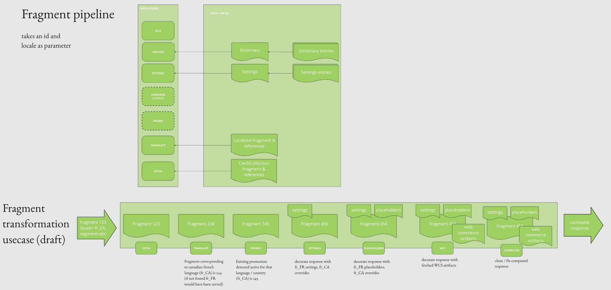

# fragment pipeline

this action sits behind mas/io/fragment in CDN and treats multiple odin related requests to provide m@s customers with :

- placeholders,
- settings,
- promotion,
- translation (we don't want surface to handle id mapping for each locale)

## configuration

you can configure a few things via state with `aio app state put/del` command
to see all configuration in place, type `aio app state list`

please don't forget that every state item has TTL defaulting to 24h! typical long live TTL to add to your command would be `--ttl=31536000`

| Configuration Key    | Description                                                                                                                                                                                 | Type    | Default |
| -------------------- | ------------------------------------------------------------------------------------------------------------------------------------------------------------------------------------------- | ------- | ------- |
| `wcs-configurations` | WCS (Web Content Service) configurations for prefilling cache, e.g. `[{"api_keys":["wcms-commerce-ims-ro-user-milo"],"wcsURL":"https://www.adobe.com/web_commerce_artifact","env":"prod"}]` Note that prefilling cache will make backend processing longer depending on the fragments you have! you can still disable it by pushing a configuration *not* having related api key for a given environment. | Array   | ``      |
| `debugFragmentLogs`  | turns debug log on                                                                                                                                                                          | Boolean | `false` |
| `network-config`     | Sets of threshold for timing out main process (`mainTimeout`) & subsequent fetches (`fetchTimeout`), e.g. `{"fetchTimeout":2000,"mainTimeout":15000,"retries":3,"retryDelay":500}`             | Array   | ``      |

Each configuration can be managed using the following commands:
https://wiki.corp.adobe.com/pages/viewpage.action?pageId=3587728545

### prod 
In prod main timeout is 15seconds, it includes time that action takes to fetch `network-config`. Main timeout is from start of the action till end of execution.
Fetch timeout is 2seconds and applied to each fetch call separately. There are multiple fetch calls to Odin and WCS. WCS ones could be disabled. 

## preview

[fragment-client.js](../fragment-client.js) is built consistently with what is deployed in adobe io runtime with
`npm run build:client` to reproduce that pipeline not in io runtime containers but on the browser.
