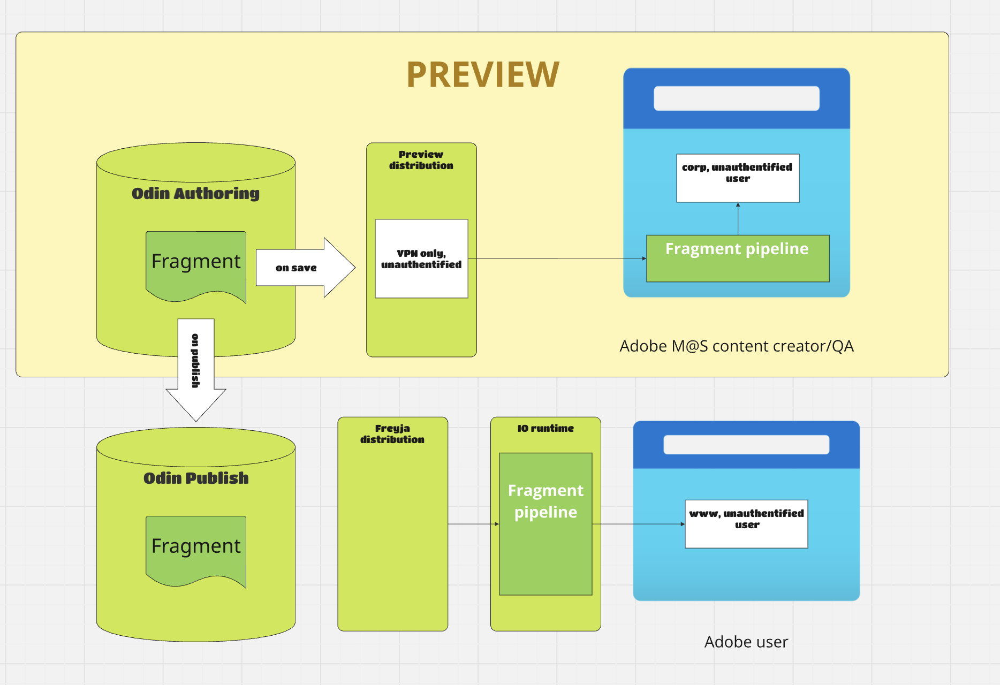

# fragment pipeline

this action sits behind mas/io/fragment in CDN and treats multiple odin related requests to provide m@s customers with :

- placeholders,
- settings,
- promotion,
- translation (we don't want surface to handle id mapping for each locale)

## configuration

you can configure a few things via state with `aio app state put/del` command
to see all configuration in place, type `aio app state list`

please don't forget that every state item has TTL defaulting to 24h! typical long live TTL to add to your command would be `--ttl=31536000`

| Configuration Key    | Description                                                                                                                                                                                 | Type    | Default |
| -------------------- | ------------------------------------------------------------------------------------------------------------------------------------------------------------------------------------------- | ------- | ------- |
| `wcs-configurations` | WCS (Web Content Service) configurations for prefilling cache, e.g. `[{"api_keys":["wcms-commerce-ims-ro-user-milo"],"wcsURL":"https://www.adobe.com/web_commerce_artifact","env":"prod"}]` | Array   | ``      |
| `debugFragmentLogs`  | turns debug log on                                                                                                                                                                          | Boolean | `false` |
| `network-config`     | Sets of threshold for timing out main process (`mainTimeout`) & subsequent fetches (`fetchTimeout`), e.g. `{"fetchTimeout":100,"mainTimeout":100,"retries":2,"retryDelay":500}`             | Array   | ``      |

Each configuration can be managed using the following commands:

## preview

[fragment-client.js](../fragment-client.js) is built consistently with what is deployed in adobe io runtime with
`npm run build:client` to reproduce that pipeline not in io runtime containers but on the browser.
