<!-- _class: lead -->
<!-- _backgroundColor: #1473E6 -->
<!-- _color: white -->

# M@S AI Assistant

## Powering Content Management with MCP and RAG

---

# What We Built

**An AI-powered content management assistant that:**

- 📇 Creates merch cards through natural language
- 🔍 Searches and discovers content across the catalog
- 📦 Performs bulk operations (publish, update, delete)
- 📚 Provides contextual documentation help

**Key Innovation**: Natural language → Real actions on backend systems

---

<!-- _class: lead -->
<!-- _backgroundColor: #2C2C2C -->
<!-- _color: white -->

# Part 1: Architecture Overview

---

# High-Level Architecture

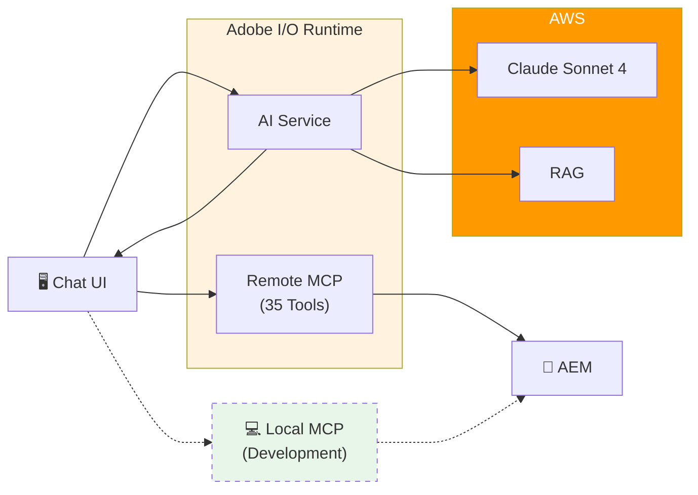

**Two MCP paths:** Production uses Remote MCP (serverless), Development uses Local MCP (port 3001)

---

# Core Components

| Component | Technology | Role |
|-----------|------------|------|
| **Chat UI** | Lit Web Components | User interface for conversations |
| **AI Service** | Adobe I/O Runtime | Orchestrates AI requests |
| **LLM** | Claude Sonnet 4 (AWS Bedrock) | Understands intent, generates responses |
| **RAG System** | Titan + OpenSearch | Retrieves relevant knowledge |
| **MCP Server** | Node.js HTTP Server | Executes operations on AEM |
| **Content Store** | AEM Cloud | Stores merch cards |

---

# What the AI Service Does

The AI Service is the **brain** that orchestrates conversations:

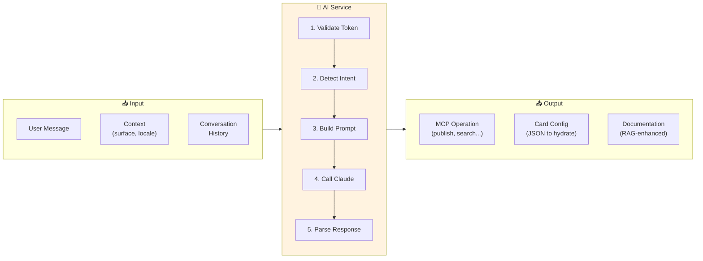

---

# AI Service Responsibilities

| Step | What It Does |
|------|--------------|
| **Authorization** | Validates IMS bearer token |
| **Intent Detection** | Card creation vs Operations vs Documentation |
| **Context Enrichment** | Adds surface, locale, recent operations |
| **RAG Integration** | Queries knowledge base for grounded answers |
| **Bedrock Call** | Sends prompt to Claude Sonnet 4 |
| **Response Parsing** | Extracts MCP operations or card configs |

---

<!-- _class: lead -->
<!-- _backgroundColor: #2C2C2C -->
<!-- _color: white -->

# Part 2: How It Works

---

# The User Journey

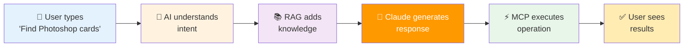

---

# Step-by-Step Flow

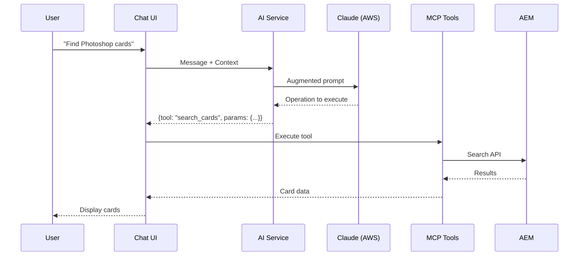

---

# Context Makes It Smart

**Every message includes context:**

```javascript
{
  message: "Find Photoshop cards",
  context: {
    surface: "commerce",      // Where you are
    locale: "en_US",          // Your language
    lastOperation: {...},     // What you just did
    workingSet: [...]         // Recent cards
  }
}
```

**Result:** "Publish all of these" just works - no need to specify which cards.

---

<!-- _class: lead -->
<!-- _backgroundColor: #2C2C2C -->
<!-- _color: white -->

# Part 3: RAG
## Retrieval-Augmented Generation

---

# What is RAG?

**Problem:** AI models don't know about your specific domain.

**Solution:** Give the AI a "reference book" to consult before answering.

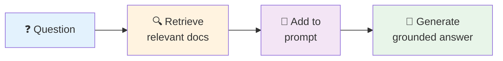

**Without RAG:** AI might hallucinate or give generic answers
**With RAG:** AI answers using your actual documentation

---

# How RAG Works

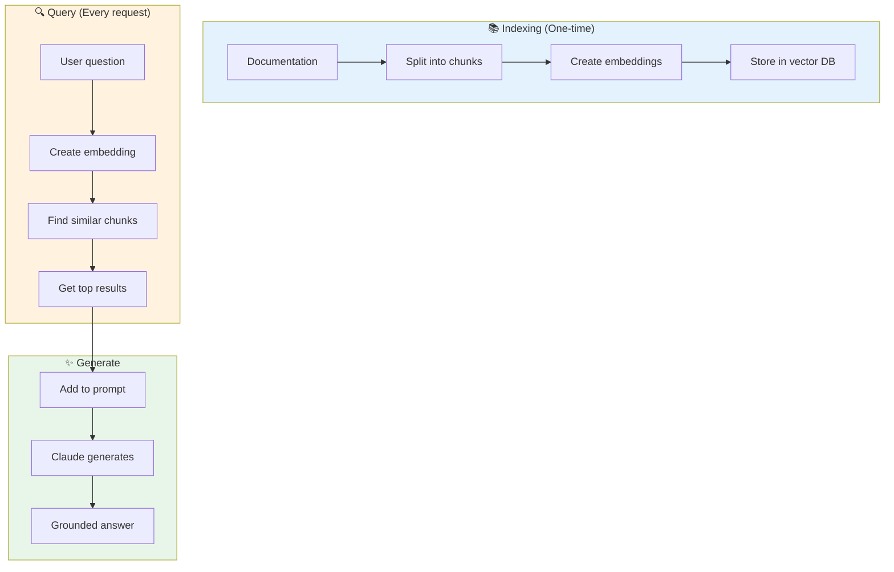

---

# Our RAG Architecture

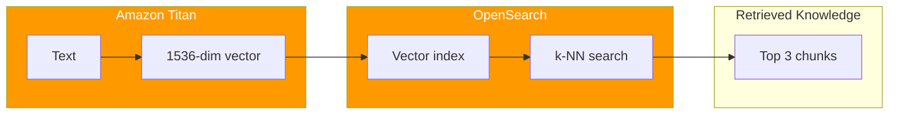

| Service | Purpose |
|---------|---------|
| **Amazon Titan** | Converts text to vectors (embeddings) |
| **OpenSearch** | Stores vectors, finds similar content |
| **Claude** | Uses retrieved knowledge in response |

---

# Three Tiers of Knowledge

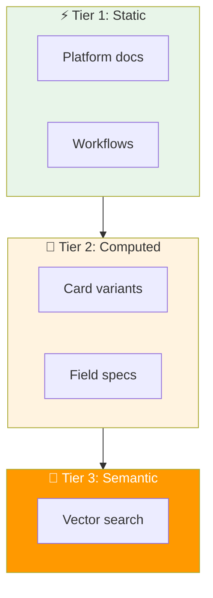

- **Tier 1:** Instant answers for common questions (cached)
- **Tier 2:** Always fresh from configuration
- **Tier 3:** Semantic search for complex queries

---

<!-- _class: lead -->
<!-- _backgroundColor: #2C2C2C -->
<!-- _color: white -->

# Part 4: MCP
## Model Context Protocol

---

# What is MCP?

**Problem:** AI can talk, but can't take actions.

**Solution:** A standard protocol for AI to use tools.

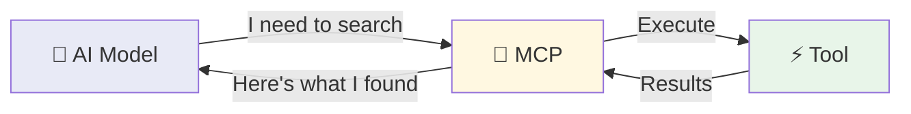

**Analogy:** MCP is like USB for AI - a universal connector.

---

# Local vs Remote MCP

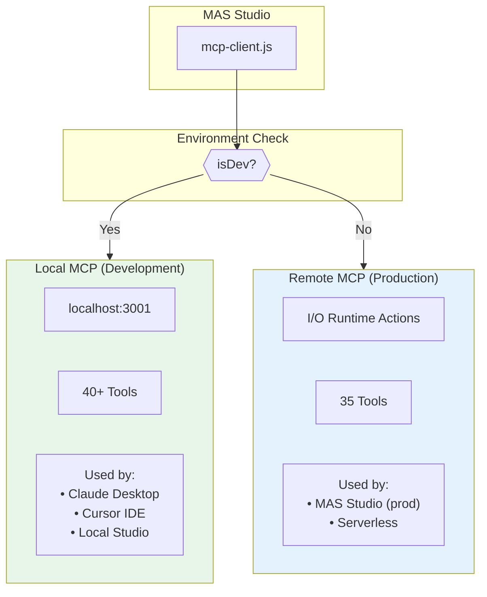

**Same tools, different deployment** - Local for dev/IDE, Remote for production.

---

# Two MCP Implementations

| Aspect | Local MCP | Remote MCP |
|--------|-----------|------------|
| **Location** | `mas-mcp-server/` | `io/mcp-server/` |
| **Port** | localhost:3001 | Serverless |
| **Deployment** | Node.js process | Adobe I/O Runtime |
| **Used By** | Claude Desktop, Cursor IDE | MAS Studio (prod) |
| **Transport** | HTTP + Stdio | HTTP only |

**Why both?**
- Local: Fast iteration, IDE integration, debugging
- Remote: Production scalability, no infrastructure needed

---

# How MCP Works

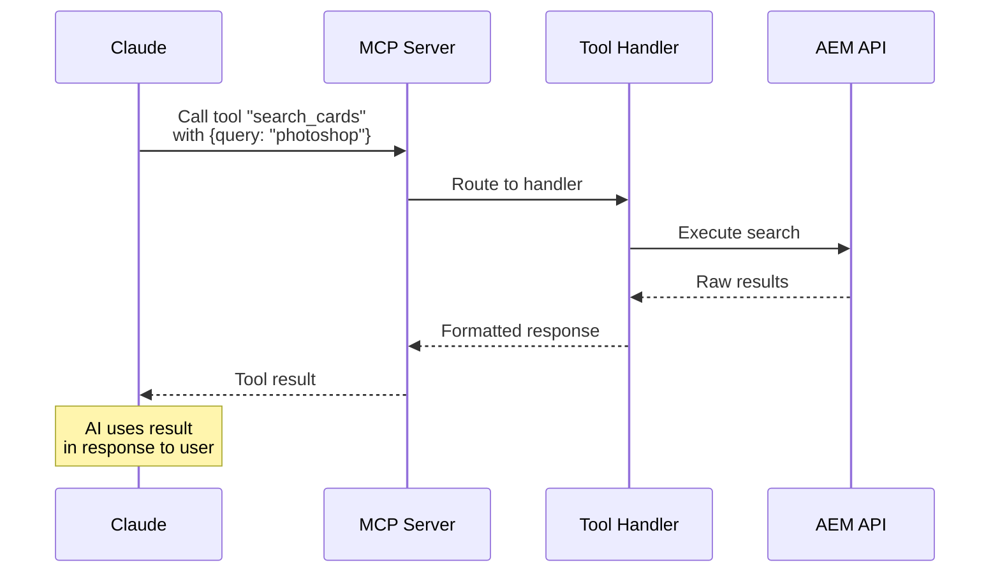

---

# Our MCP Tools (35 Total)

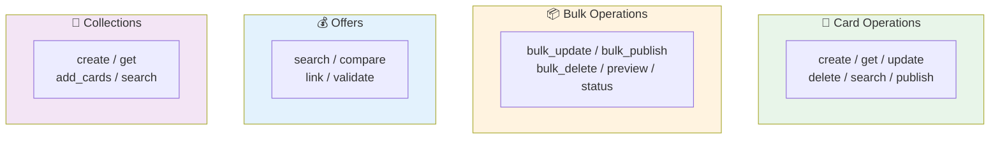

---

# MCP Tool Example

**User says:** "Create a Photoshop plans card"

**AI generates:**
```json
{
  "tool": "create_card",
  "params": {
    "variant": "plans",
    "title": "Photoshop",
    "surface": "commerce",
    "fields": {
      "badge": "Best Value",
      "prices": "..."
    }
  }
}
```

**MCP executes:** Creates card in AEM, returns preview URL

---

# Why MCP Matters

<div class="columns">
<div>

### For the AI
- Standard way to take actions
- Clear tool definitions
- Structured responses

</div>
<div>

### For Us
- One protocol, many tools
- Easy to add new capabilities
- Works across clients

</div>
</div>

**Works in:** MAS Studio, Claude Desktop, Cursor IDE

---

<!-- _class: lead -->
<!-- _backgroundColor: #2C2C2C -->
<!-- _color: white -->

# Putting It All Together

---

# Complete Picture

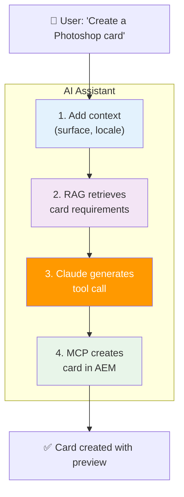

---

# Key Takeaways

| Concept | What It Does |
|---------|--------------|
| **Architecture** | Chat UI → AI Service → AWS → MCP → AEM |
| **Flow** | Context enrichment → RAG → Claude → Tool execution |
| **RAG** | Grounds AI responses in actual documentation |
| **MCP** | Turns AI conversations into real actions |

**Result:** Content managers describe what they want in plain English, and it happens.

---

<!-- _class: lead -->
<!-- _backgroundColor: #1473E6 -->
<!-- _color: white -->

# Demo Time!

---

# Demo Highlights

1. **Natural Language Search**
   "Find all Photoshop cards" → Shows results instantly

2. **AI Card Creation**
   "Create a plans card for Photoshop" → Card appears with validation

3. **Bulk Operations**
   "Publish all of these" → Preview, approve, track progress

4. **Platform Knowledge**
   "What is Odin?" → Accurate answer from RAG

---

<!-- _class: lead -->
<!-- _backgroundColor: #1473E6 -->
<!-- _color: white -->

# Questions?
